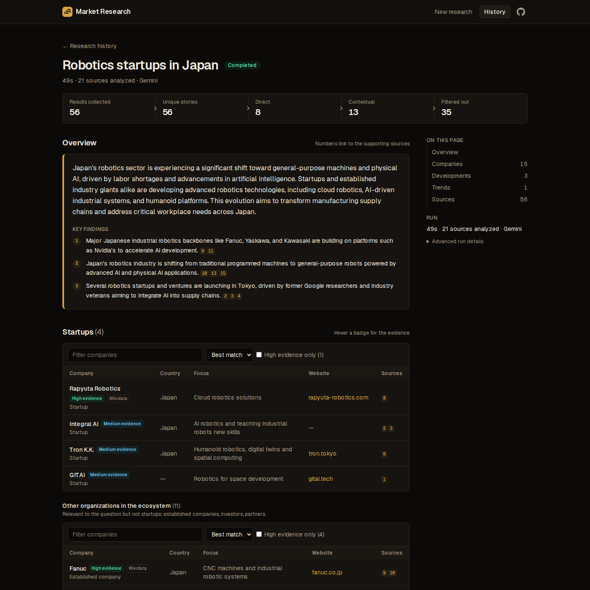
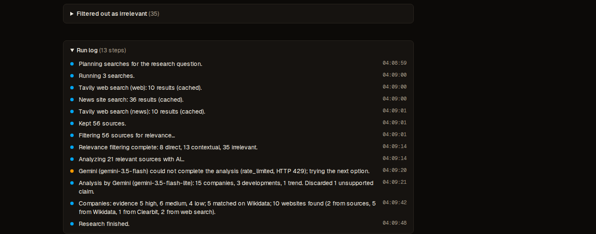
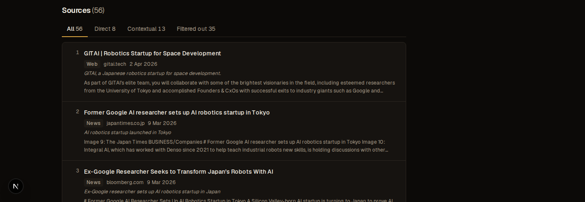

# AI Market Research Platform

**[Live demo →](https://ai-market-research-platform-omega.vercel.app/)**

An AI-powered market research system that turns natural-language research
questions into structured, source-backed reports using multi-source web
research, relevance classification, entity verification, and
evidence-grounded AI analysis. Every finding in a report links back to the
sources that support it, and nothing in the app is mocked: research runs
collect real sources, classify and analyze them with real AI providers, and
resolve companies against real external data.



## What this demonstrates

- Multi-provider web research pipelines (Tavily web/news search, plus seven
  curated news-site RSS feeds)
- LLM-based classification and structured extraction
- Evidence-grounded AI generation, with citations validated in code, not
  trusted from the model
- Source deduplication and story grouping across outlets
- Constraint-aware relevance filtering (topic, geography, entity type,
  industry, time range)
- Entity classification and verification against Wikidata and other sources
- Supabase/Postgres persistence, including a transactional save function
- Resilient API handling and fallbacks across every external dependency
- Background research execution with a live, per-stage progress log
- Structured JSON outputs enforced by schema and validated after the fact
- Next.js / TypeScript full-stack development

## Architecture

```
User question
      │
      ▼
Search planner — web + news search, plus a focused search when given
      │
      ▼
Collect — Tavily (web/news) + 7 curated news-site RSS feeds, concurrently
      │
      ▼
Normalize + deduplicate — clean URLs/titles, group the same story across outlets
      │
      ▼
Constraint extraction — topic, geography, entity type, industry, time range
      │
      ▼
AI relevance classifier (deterministic keyword scorer as fallback)
      │
      ├── Direct       — about the question's topic, place and kind of organization
      ├── Contextual   — useful background, sent to analysis marked as such
      └── Irrelevant   — kept for auditing, not analyzed
      │
      ▼
Filtered story set (direct + contextual primaries)
      │
      ▼
AI synthesis — one call: overview, companies, developments, trends
      (Gemini first, Groq as fallback)
      │
      ▼
Entity resolution — Wikidata match, Clearbit/Tavily website discovery,
      multi-signal verification confidence
      │
      ▼
Evidence-backed report — every claim validated against real source citations
      │
      ▼
Supabase (Postgres) — persisted in one transaction
```

## Example research

Research question: **"Robotics startups in Japan"**

| Stage | Count |
| --- | --- |
| Results collected | 56 |
| Unique stories (after dedup) | 56 |
| Direct | 8 |
| Contextual | 13 |
| Filtered out (irrelevant) | 35 |
| Sent to AI analysis | 21 |
| Companies identified | 15 |

Sources unrelated to Japan — Indian funding round-ups (Inc42), African tech
newsletters (TechCabal), Australian startup news (Startup Daily), and
China/Korea-focused robotics stories — were filtered out as irrelevant,
while Japan-specific context (Nvidia's partnerships with Japanese firms,
McKinsey's analysis of Japan's robotics market) was kept as contextual. The
15 companies identified split into startups (Rapyuta Robotics, Tron K.K.,
GITAI) and established incumbents named for context (Fanuc, Yaskawa
Electric, Kawasaki Robotics), each labelled and evidenced separately rather
than presented the same way.

## Screenshots

Both from the run above.

**Run log**, showing collection, deduplication, relevance filtering, AI
analysis (including a live fallback: Gemini's flash model was rate-limited,
so the run retried on flash-lite), and entity resolution:



**Sources**, tabbed by Direct / Contextual / Filtered out, with each entry's
publisher, date and snippet:



## How a research run works

Submitting a question creates a `pending` research and redirects to its page.
The run then executes in the background of that request (Next.js `after()`,
within Vercel's 300s function limit) and reports progress as it goes:

1. **Plan**: a fixed set of searches (web, news, and a focused web search
   when a focus is given).
2. **Collect**: searches run concurrently against each provider. Timeouts,
   rate limits, exhausted quotas and malformed responses are caught per
   search, logged in plain language, and the run continues with whatever
   succeeded. It fails only if every source fails.
3. **Process**: exact duplicates, normalization, story grouping (see below),
   constraint extraction, and AI relevance classification into direct,
   contextual and irrelevant (see Relevance filtering below).
4. **Store**: sources are upserted with a unique constraint on
   `(research_id, canonical_url)`, so exact duplicates cannot slip in.
5. **Analyze** and **resolve**: the filtered sources are synthesized into a
   report and its companies resolved against real external data (see AI
   analysis and Entity resolution below).

Each stage writes to `research_events`, which the page shows as a live run
log. The page refreshes itself while the run is active.

**Providers** sit behind a small `SearchProvider` interface:

| Provider | Used for | Notes |
| --- | --- | --- |
| Tavily | Web and news search | Needs `TAVILY_API_KEY`; 1 credit per search |
| News site search | News from 7 curated outlets | Free, no key; WordPress search feeds (`/?s=<keywords>&feed=rss2`) |

The news-site search queries each outlet's WordPress search feed, which
returns full-text search results as RSS, often reaching back months. The
outlets (TechCrunch, Crunchbase News, Inc42, Startup Daily, TechCabal,
SecurityWeek, UKTN) were each checked by hand to return real,
topic-filtered results. Individual outlets failing is reported as a warning
in the run log; the search fails only if none can be read. GDELT was tried
first and dropped: it rate-limits shared IPs (including Vercel's) and
returned no results for typical queries.

## Normalization and deduplication

All deterministic; no LLM involved.

1. **Exact duplicates.** URLs are normalized (scheme, `www`, host case,
   tracking parameters, fragments, trailing slashes, parameter order) and
   sources with the same normalized URL are merged, keeping a record of every
   search that found them.
2. **Normalization.** Block and error pages ("Access Denied", "Just a
   moment...") are dropped. Titles lose leading emoji and trailing site names
   ("... | Wellfound", "... - Wikipedia") when the suffix matches the publisher
   or host, and truncated titles are flagged. Publisher names are unified
   across providers (`inc42.com` from web search and `Inc42` from the news
   search become one outlet). Future and pre-1995 dates are discarded.
3. **Story grouping.** Sources reporting the same story under different URLs
   are grouped, not deleted: each duplicate points at its story's primary
   (`sources.duplicate_of`), so every outlet stays visible as evidence. Two
   sources are the same story when:
   - their titles are near-identical (Jaccard >= 0.9), or
   - both are dated within 4 days and their titles are similar (Jaccard, or
     containment for rewrites that extend a headline), or
   - both are dated within 3 days and share a money figure *and* a
     non-generic word: "Exein raises $270 Million" and "Italy's Exein hits
     unicorn status with $270m".

   The rules favour precision, because merging two different stories hides
   evidence. Words from the research question are ignored for title
   similarity (every result shares them). Recurring formats with identical
   titles (weekly round-ups) are kept apart by their dates. A source joins a
   group only by matching its primary, which prevents A~B~C chains, except
   through the figure rule, which is strong enough to bridge "$270M" and
   "$1.7B valuation" headlines about one round via a headline stating both.

   On real coverage of one funding round, 12 reports from different outlets
   were grouped into one story with no false merges across three unrelated
   research runs. Headline rewrites with no shared figure or wording ("New
   Italian unicorn Exein rides the physical AI wave") are not caught; that is
   left to the AI stages.

## Relevance filtering

Keyword search returns plenty of sources that only *mention* a query word
(Australian funding round-ups and African tech newsletters for "Robotics
startups in Japan" — see Example research above). Between deduplication and
analysis, every story is classified by the AI against the question's
constraints:

- The classifier first extracts the constraints: **topic, geography, entity
  type** (startup, established company, investor...), **industry** and
  **time range**. They are stored on the research and reused later.
- Each story is labelled **direct** (about the topic, place and kind of
  organization asked for), **contextual** (useful background: the same
  topic and place with other kinds of organizations, or global developments
  with clear bearing on that place) or **irrelevant**, with a 0-1 score and
  a short reason ("about Australian startup funding, not Japan").
- Stories are sent in batches of 30 (one AI call each), sequentially, so a
  batch fits Groq's free-tier token-per-minute limit; Gemini is tried first.
- **Only direct and contextual stories reach the analysis**, direct first;
  contextual ones are marked `[context]` in the prompt so companies and
  developments come mainly from direct sources.
- Irrelevant stories are **kept**, with their label and reason, and shown in
  a collapsed "Filtered out" group next to All / Direct / Contextual tabs.
- If the AI is unavailable or skips sources, a deterministic keyword scorer
  (topic and place coverage with demonyms, cities, regions and regional
  outlets) labels the rest, and the run log says so. A classification
  failure never loses the run.

This is not simple keyword filtering: the keyword scorer only stands in when
the AI is unavailable, and the AI classification itself reasons about the
question's actual constraints (topic, geography, entity type, industry,
time range) rather than matching literal words.

## Company classification, verification and ordering

- **Entity type**: the analysis classifies every company as startup,
  established company, investor, partner, research institution or other,
  from what the sources say (founding year, funding stage, listing), with
  the evidence stored. Wikidata can overrule a "startup" claim: a publicly
  listed company, or one founded more than 15 years ago, is an established
  company. When the question asks for a kind of organization, those are
  listed first and everything else appears as "Other organizations in the
  ecosystem" (Fanuc, Yaskawa Electric and Kawasaki Robotics for Japanese
  robotics startups; SentinelOne, Snyk and Netskope for European
  cybersecurity startups).
- **Verification confidence** (high / medium / low) combines signals rather
  than relying on Wikidata: an official website (from the sources or
  Wikidata) or a name-matched one, coverage by reputable outlets, the number
  of independent outlets (the company's own site and press wires don't
  count), a Wikidata match, and whether the country agrees across evidence.
  High needs a website plus reputable coverage, three independent sources,
  or a Wikidata match with further support; a single weak mention is low.
- **Ordering**: requested entity type, then requested geography, topic, and
  evidence strength.

## AI analysis and source attribution

By the time this step runs, sources have already passed AI relevance
classification in batches (see Relevance filtering above) — this step is a
single further AI call, over the filtered story primaries (direct and
contextual, duplicates not sent), that turns them into the report. Its
result is saved with the research; opening a finished research never calls
the AI again.

- **Input**: a compact, line-per-source list (title, publisher, date, domain,
  short snippet, "also reported by N outlets"), sources referred to as
  `S1..Sn`. The model is told to use only these sources, not its own
  knowledge, and to cite source IDs for every item.
- **Output**: JSON enforced by the provider's structured-output mode, with the
  same schema for every provider (overview + key findings, companies, recent
  developments, emerging trends).
- **Validation** (code, not trust): aliases are mapped back to real source
  IDs; citations to unknown IDs are dropped, and items left without a
  citation are dropped; a trend needs at least two sources; dates must be
  real and not in the future; a company website is kept only if that exact
  domain appears in the sources. The run log reports how many claims were
  discarded.
- **Persistence**: `save_research_analysis`, a Postgres function, stores
  companies (`entities`), findings, their evidence links
  (`finding_sources`) and the report in one transaction, re-checks that every
  cited source belongs to the research, and refuses a second analysis. It is
  not executable with the public key.
- **In the UI**, every claim carries numbered citations that jump to the
  supporting source (and its "also reported by" outlets) in the source list.

**Providers and fallback.** Gemini and Groq, both on free tiers, behind an
`AIProvider` interface. The chain is each model in `GEMINI_MODELS` in turn,
then Groq (`AI_PROVIDERS` reorders it). A provider is skipped on any failure:
HTTP errors, rate limits, quota, timeouts, or output that fails validation.
Free Flash models are often overloaded (HTTP 503), so Flash-Lite follows Flash.
Prompts are sized per provider: Groq's free tier allows 8,000 tokens per
minute, so its prompt keeps the most informative sources that fit (typically
~30 of 60), with shorter snippets. If every provider fails, the research still
completes with its sources and the log says why there is no analysis.

## Entity resolution

Companies extracted by the AI are resolved to real organizations before the
analysis is saved. A company name alone is never treated as an identity.

1. **Wikidata candidates.** One full-text search per company, restricted to
   organization classes (a plain label search for "CRED" ranks "credit card"
   and a town in Devon first), with a label search as fallback. Candidates and
   their countries are then fetched in batches. Everything is cached for 30
   days and shared across research runs.
2. **Scoring.** A candidate must match the name (with or without corporate
   suffixes) and be an organization. Evidence then adds up: its country
   matches the sources (**a mismatch disqualifies**), its website matches a
   domain seen in the sources (strongest signal; a different website counts
   against), its description fits the research. It is accepted only with
   enough evidence **and** a clear lead over the next candidate; otherwise
   the company stays *unresolved* or *ambiguous*. Real cases from the test
   data: India's Xflow is not merged with Denmark's XFlow, an Indian "Navi"
   is not matched to a Hungarian NAVI, and CRED resolves to the Indian
   company rather than a same-named US one.
3. **Merging.** Extracted companies that resolve to the same Wikidata item or
   domain are merged ("Cred" and "CRED"), with their citations combined.
4. **Websites**, in order of trust, each step only for companies the
   previous ones left without one:
   1. a domain that appears in the collected sources;
   2. the official website of a resolved Wikidata item;
   3. **Clearbit Autocomplete** (free, no key): the suggestion's name must
      equal the company name, its domain must match that name, and a domain
      in *another* country's ccTLD is dropped (`clinomic.in` is not a German
      company's site, `perfios.com.br` not an Indian one's); if several
      domains remain it is treated as ambiguous and skipped. Clearbit covers
      startups far better than Wikidata but is unmaintained with no SLA, so it
      is never the only step;
   4. **Tavily web search**, at most 3 live lookups per research, most-cited
      companies first: the first result whose domain matches the company
      name, skipping aggregators like LinkedIn or Crunchbase.

   Clearbit and search websites are name matches, not verified identities, and
   the UI says so. On two real research runs this raised website coverage from
   4 of 15 to 10 of 15 (Germany) and 4 of 14 to 10 of 14 (India).

**Keeping external requests low.** All lookups are cached and shared across
research runs (Wikidata and raw Clearbit/Tavily responses for 30/21 days),
cached answers are read before any live request, and only Tavily (the one
lookup that costs credits) has a per-research cap. DuckDuckGo was tried first
and dropped: it served a bot check after about three requests from a
residential IP and blocked Vercel's datacenter IPs on the very first one.

The companies table shows a **Wikidata** badge (with the matching evidence)
for resolved companies and **Unverified**/**Ambiguous** otherwise, and where
each website came from.

**Caching**: raw provider responses are cached in Postgres
(`provider_cache`) keyed by a hash of the request, for 24h (web) or 6h
(news). Feeds are validated before caching, so a blocked or HTML response
is never cached. Raw responses are cached rather than parsed results, so parser fixes
apply to cached data immediately.

## Reliability

Mechanisms actually implemented, not aspirational ones:

- A provider (search or AI) failing does not fail the whole research; the
  run continues with whatever succeeded, and the run log explains what
  failed and why.
- AI analysis falls back from Gemini to Groq on any error, rate limit,
  quota, timeout or output that fails validation.
- AI relevance classification falls back to a deterministic keyword scorer
  when the AI is unavailable or skips sources.
- Database requests are timed out so a hung connection cannot stall a run.
- Company resolution runs against a time budget; remaining website lookups
  are skipped, not left hanging, once it is spent.
- AI output is enforced by JSON schema and independently re-validated in
  code: unknown source citations are dropped, items left without a real
  citation are dropped, dates must be real and not in the future.
- The final report and its resolved entities are saved together in one
  Postgres transaction (`save_research_analysis`), which also re-checks that
  every cited source belongs to the research and refuses to run twice.
- Sources filtered out as irrelevant are never deleted: they are kept,
  labelled, and shown in a collapsed group, so a run can be audited.

## Limitations

- AI relevance classification can vary between runs, since it depends on the
  model's judgement, not fixed rules; the deterministic keyword scorer is a
  fallback, not a substitute for it.
- Country information can be missing for a company when the sources never
  state it and it has no Wikidata entry — left blank rather than guessed,
  including when a company's only evidence names more than one country (its
  own site mentioning both a location and an unrelated proper noun that
  happens to contain a demonym, for example) or none at all.
- Name-matched websites (Clearbit, Tavily search) are weaker evidence than a
  website that actually appears in the collected sources or on the matched
  Wikidata item, and the UI labels them differently.
- Search quality depends partly on the external providers: Tavily's index
  and the seven news sites' own search feeds, neither controlled by this
  app.
- Free-tier model and provider limits (Gemini/Groq token-per-minute caps,
  Tavily credits) can affect how many sources reach analysis and how much
  detail their snippets carry.

## Tech stack

- **Next.js 16** (App Router, TypeScript, Tailwind CSS 4), deployed on **Vercel**
- **Supabase** (PostgreSQL)
- **Gemini** with **Groq** fallback (free tiers), behind a provider interface

## Project structure

```
src/
  app/                  routes: / (new research), /research (history),
                        /research/[id] (report), /api/health
  components/           shared UI
  lib/
    env.ts              server env handling
    research.ts         research queries
    pipeline/           run orchestration, search plan, merge, normalize, dedup
    providers/          Tavily and news-site (RSS) search, provider cache
    ai/                 Gemini and Groq clients, fallback chain
    entities/           Wikidata resolution, Clearbit/Tavily website discovery
    http.ts             timeouts, retries, typed provider errors
    url.ts              URL normalization
    supabase/           server-only Supabase client + database types
supabase/migrations/    SQL schema
```

## Data model

| Table | Purpose |
| --- | --- |
| `researches` | One row per research question, with its processing status |
| `sources` | Collected documents; unique per research on normalized URL |
| `research_events` | Run log: what each stage did, including degraded sources |
| `provider_cache` | Cached raw responses from external providers |
| `entities` | Resolved organizations; unique per research on domain, never on name alone |
| `findings` | Developments, trends and facts, optionally tied to an entity |
| `finding_sources` | Evidence links: which sources support which finding |
| `reports` | AI overview for a research, with provider/model/token metadata |

Row level security is enabled on every table with no policies. The public
Supabase key can read nothing, and all database access happens in server code.

## Local setup

Requires Node.js 20+ and a Supabase project.

```bash
npm install
cp .env.example .env.local   # fill in your Supabase URL and service-role key
```

Apply the schema by running
`supabase/migrations/20260923000000_initial_schema.sql` in the Supabase SQL
editor, or with the Supabase CLI:

```bash
npx supabase link --project-ref <your-project-ref>
npx supabase db push
```

Then:

```bash
npm run dev          # http://localhost:3000
npm test
npm run typecheck
npm run lint
npm run build
```

`GET /api/health` reports whether the app can reach the database.

## Environment variables

| Variable | Required | Notes |
| --- | --- | --- |
| `SUPABASE_URL` | yes | Project URL |
| `SUPABASE_SERVICE_ROLE_KEY` | yes | Server-only secret key. Never prefix with `NEXT_PUBLIC_` |
| `TAVILY_API_KEY` | no | Web/news search. Without it, runs use the news-site search only |
| `GEMINI_API_KEY` | one of these two | AI analysis, primary |
| `GROQ_API_KEY` | one of these two | AI analysis, fallback |
| `GEMINI_MODELS` | no | Comma-separated, tried in order. Default `gemini-3.5-flash,gemini-3.5-flash-lite` |
| `GROQ_MODEL` | no | Default `openai/gpt-oss-120b` |
| `AI_PROVIDERS` | no | Fallback order, default `gemini,groq` |
| `RESEARCH_HOURLY_LIMIT` | no | Research runs allowed per rolling hour, app-wide. Default 20 |
| `SUPABASE_DB_PASSWORD` | no | Used only by the Supabase CLI for `db push`; the app never reads it |
